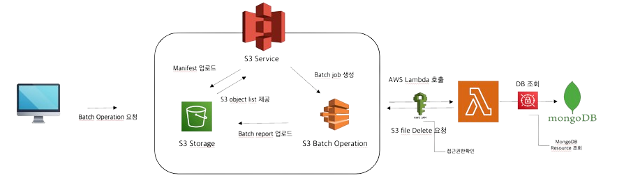

## Chat-chat File Management System
### WebSocket 기반 채팅 애플리케이션의 파일 처리 모듈
***
## 📝 프로젝트 개요

- 프로젝트명: Chat-chat (WebSocket 기반 실시간 채팅 애플리케이션)
- 개발 기간: 2025.01 ~ 2025.02
- 인원 구성: Backend 4명, Frontend 1명 (총 5명)
- 담당 역할: 파일 관리 모듈 설계 및 구현
- 주요 기능: S3 Batch Operation을 활용한 고아 객체 자동 정리 시스템 개발
***

## 🛠 기술 스택
#### Backend

- Language & Framework: Kotlin, Spring Boot
- Database: MongoDB Atlas(채팅 메시지 및 S3 파일 url 저장)
- Message Broker: WebSocket
- Cloud: AWS S3, Lambda, Secrets Manager, IAM
- Build Tool: Gradle
- AWS SDK: AWS SDK for Java 2.x
***

## ⚙️ 시스템 아키텍처
#### 1. 파일 처리 시스템 구조


- WebSocket을 통한 실시간 파일 전송
- S3를 활용한 파일 저장 및 관리
- MongoDB를 통한 파일 메타데이터 관리
- Batch Operation을 통한 고아 객체 정리

#### 2. 매니페스트 생성 시스템
```kotlin
fun createManifest(): String {
    val s3Objects = s3Client.listObjectsV2(requestObject).contents()
    val manifestContent = buildString {
        s3Objects.forEach { obj ->
            val encodedKey = URLEncoder.encode(obj.key(), StandardCharsets.UTF_8.name())
            appendLine("${bucket},\"${encodedKey}\"")
        }
    }
}
```
- S3 Client로 S3 접근
- 각 S3 요청 object에 대한 manifest 파일 생성
- S3의 Object key로 manifest List 작성
#### 3. Batch Operation 처리 흐름

- 채팅방별 파일이 DB에 참조하는지 확인
- 람다함수를 이용하여 미참조 파일 S3에 제거 요청
- 처리 결과 리포트 생성 후 S3 Storage에 저장
***
## 💡 주요 구현 기능
#### 1. 파일 업로드 및 관리 묘듈화

- 파일 업로드 및 파일시스템을 관리하는 별도의 모듈로 설계
- 실시간 채팅 중 파일 전송 처리
- S3 스토리지 연동
- 파일 메타데이터 관리

#### 2. 고아 객체 정리 시스템

- S3 Batch Operation 활용
- Lambda 함수를 통한 파일 검증
- 스케쥴러를 활용한 파일 정리 프로세스 자동화

#### 3. 보안 강화

- AWS IAM Role 기반 접근 제어
- AWS Secrets Manager를 통한 인증 정보 관리
- 파일 접근 권한 관리

***
## 🎯 기술적 도전과 해결 과정
#### 1. MongoDB 데이터 연동
  - 문제 상황 분석
    - 보안 문제

        - Lambda 함수에 MongoDB 접속 정보가 하드코딩되어 보안 취약점 발생
        - 접속 정보 변경 시마다 Lambda 함수 재배포 필요
        - 환경 변수를 통한 관리도 보안상 위험 존재
        - 운영 환경별 접속 정보 관리의 어려움

    - 리소스 관리 비효율

        - 매 요청마다 새로운 MongoDB 연결 생성으로 인한 리소스 낭비
        - Connection Pool 미사용으로 인한 성능 저하
        - MongoDB 연결 관리 로직과 비즈니스 로직의 결합도가 높음
  - 해결방안

      - AWS Secrets Manager 도입
        - MongoDB 접속 정보를 AWS Secrets Manager에 안전하게 저장
        - IAM Role을 통한 접근 권한 제어로 보안 강화
        - Lambda 함수가 실행 시점에 필요한 접속 정보를 동적으로 획득

#### 2. 파일명 처리 문제
- 문제상황

    - 인코딩 불일치 문제

        - S3 Key로 URL을 만든 뒤 DB의 URL 조회 시 인코딩이 달라 조회 불가능
        - 한글 파일명 저장 시 MongoDB의 URL과 S3 key 불일치 발생
        - URL 생성 시점과 저장 시점의 인코딩 방식 차이로 인한 불일치

    - CSV 매니페스트 생성 문제

        - 파일명에 특수문자 포함 시 CSV 파싱 오류 발생
        - 쿼리 파라미터로 인식되는 특수문자 처리 필요
        - 파일명에 쉼표(,) 포함 시 CSV 형식 훼손
- 해결방안

  - UUID 기반 조회 방식 도입

    - 파일명을 제외한 UUID를 기반으로 조회하도록 변경
    - 원본 파일명은 메타데이터로 별도 관리
    - 파일 식별자와 표시 파일명 분리

  - URL 인코딩 표준화

    - URL encoder를 사용하여 모든 파일명 인코딩 처리
    - 특수문자가 포함된 파일명도 안전하게 처리
    - CSV 매니페스트 생성 시 인코딩된 파일명 사용
***
## 🌱 성능 개선 및 최적화
#### 1. Lambda 함수 개선

- 책임 분리를 통한 모듈화
- 비동기 처리 방식 도입

#### 2. 배치 처리 최적화

- 처리 단위 최적화
- 병렬 처리 도입

***
## 📊 프로젝트 성과
#### 1. 정량적 성과

- 고아 객체 정리 자동화로 스토리지 비용 절감
- 파일 처리 속도 향상
- 시스템 안정성 향상

#### 2. 기술적 성장

- AWS 서비스 통합 경험
- NoSQL 데이터베이스 활용

#### 3. 협업 및 문서화

- 명확한 인터페이스 설계
- 테스트 자동화 구현
- Notion을 이용한 상세한 기술 문서 작성 및 팀원과 적극소통
***
## 🔄 향후 발전 계획
#### 개선 계획

  - 실시간 모니터링 강화

#### 확장 계획

- 파일 형식별 처리 로직 다각화
- 채팅방의 파일 외에 User의 파일 등, 다른 entity에서 접근하는 파일 관리 로직 추가
- 배치 작업의 에러시 복구 로직 추가