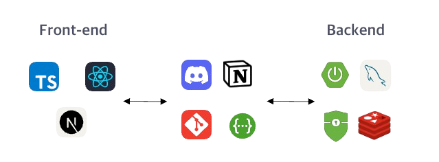
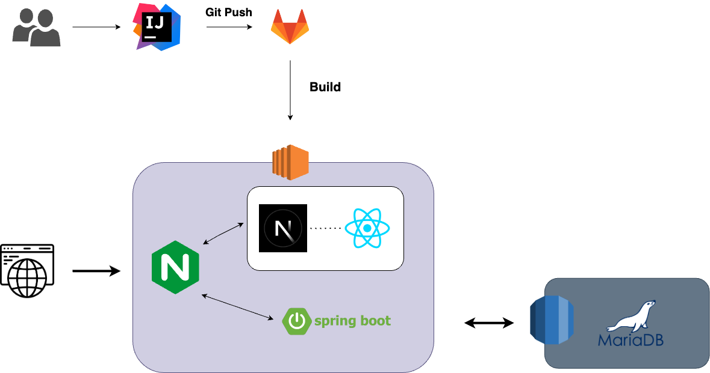
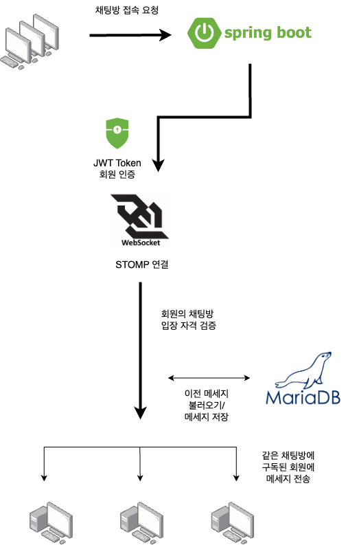
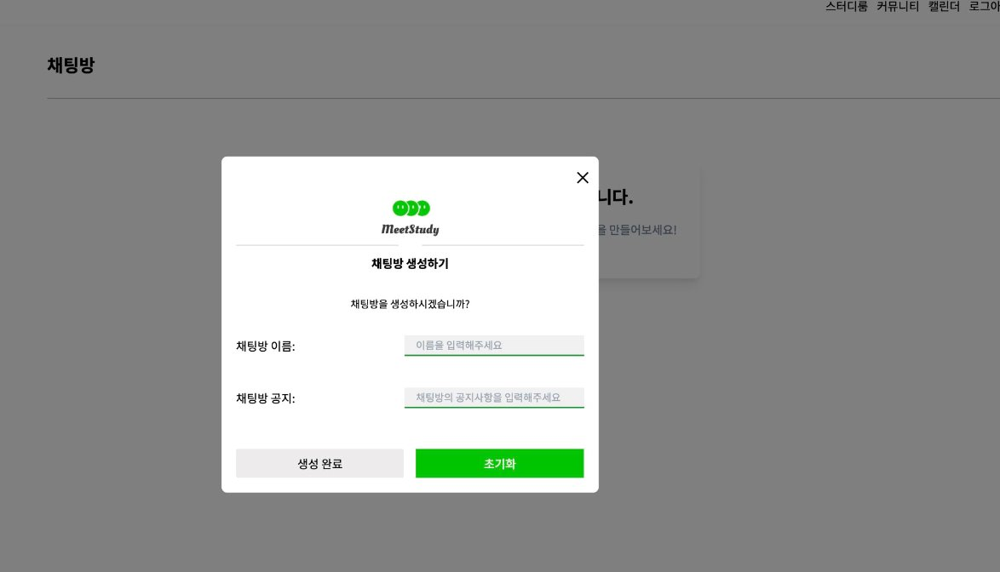

## 학습 커뮤니티 플랫폼 MeetStudy 
### 실시간 채팅 기능 구현
***
## 📝 프로젝트 개요

- 프로젝트명: MeetStudy (학습 커뮤니티 플랫폼)
- 개발 기간: 2024.05 ~ 2024.06 
- 인원 구성: Backend 6명, Frontend 2명 (총 8명)
- 담당 역할: 실시간 채팅 시스템 설계 및 구현
- **시연영상** [**🔗시연**](https://docs.google.com/file/d/1KyIKEYIsjfmbQS9R3tXC2fcz0CPK0pnS/preview?pli=1)
- **GitHub:** [**🔗 Repository**](https://github.com/YAE-Joon/meetstudy)
***

## 🛠 기술 스택

#### Backend

- Language & Framework: Spring Boot
- WebSocket: STOMP
- Security: Spring Security, JWT
- Database: MariaDB
- ORM: JPA/Hibernate
- API Documentation: Swagger

#### Frontend

- Language: TypeScript
- Framework: React

#### Deployment

- Cloud: AWS
- Server: NginX
- CI/CD: Git Actions
*** 
## ⚙️ 프로젝트 구조
#### 1. 프로젝트 아키텍쳐



***
#### 2. 채팅 아키텍쳐

## 💡 주요 구현 기능
#### 1. 채팅방 관리 시스템


```java
@Entity
public class ChatRoom {
    @Column(name = "title")
    private String title;
    
    @Column(name = "notice")
    private String notice;
    
    @OneToOne(fetch = FetchType.LAZY)
    private User chatAdmin;
    
    @ManyToOne(fetch = FetchType.LAZY)
    private StudyRoom studyRoom;
}
```

- 채팅방 CRUD 기능 구현
- 공지사항 설정 및 관리 기능
- 방장 권한 관리 시스템
- 스터디룸별 채팅방 관리

#### 2. 실시간 메시지 처리

```java
@Service
public class MessageService {
    public OutputMessageModel sendMessage(MessageModel messageModel, Long chatRoomId, User user) {
        Message message = Message.builder()
            .chatRoom(chatRoomRepository.findChatRoomById(chatRoomId))
            .createAt(LocalDateTime.now(ZoneId.of("Asia/Seoul")))
            .sender(user)
            .content(messageModel.getContent())
            .build();
        messageRepository.save(message);
        return new OutputMessageModel(message);
    }
}
```
- WebSocket과 STOMP를 활용한 실시간 메시지 전송
- 메시지 영속화 및 조회 기능
- 입장/퇴장 메시지 자동 생성
- 커서 기반 페이지네이션으로 이전 메시지 조회

#### 3. 보안 기능 강화
```java
@Component
public class StompHandler implements ChannelInterceptor {
    @Override
    public Message<?> preSend(Message<?> message, MessageChannel channel) {
        StompHeaderAccessor accessor = StompHeaderAccessor.wrap(message);
        if (accessor.getCommand() == StompCommand.CONNECT) {
            String token = extractToken(accessor);
            validateToken(token);
            setUserInSession(accessor);
        }
        return message;
    }
}
```
- JWT 토큰 기반의 사용자 인증
- WebSocket 연결 보안 강화
- Handler 레벨의 사용자 권한 검증
***
## 🎯 성과 및 문제 해결
#### 1. 메세지 조회 성능 최적화
```java
@Query("SELECT m FROM Message m "
    + "JOIN FETCH m.sender s "
    + "JOIN FETCH m.chatRoom c "
    + "WHERE c.id = :chatRoomId "
    + "and m.id < :cursor "
    + "order by m.id DESC")
  
```
  - 커서 기반 페이지네이션 구현
  - JPA N+1 문제 해결을 위한 fetch join 적용
  - 무한 스크롤 방식 메시지 로딩 구현

  
#### 2.WebSocket 보안 강화

- JWT 토큰 검증 로직 구현
- 사용자 권한 기반의 접근 제어
- 세션 관리를 통한 보안 강화


#### 3. 채팅방 권한 관리

- 방장 권한 부여 및 변경 기능
- 공지사항 관리 권한 제어
- 채팅방 생성 및 삭제 권한 관리

#### 4. 프론트엔드 협업 강화

- STOMP 프로토콜 연동을 위한 긴밀한 협력
- 실시간 테스트 및 디버깅 협업
- 효율적인 커뮤니케이션 체계 구축


## 🌱 배운 점

- WebSocket과 STOMP 프로토콜에 대한 실무 경험
- 실시간 통신 시스템의 보안 설계 방법
- JPA를 활용한 효율적인 데이터 접근 최적화
- 페이지네이션을 통한 대용량 데이터 처리
- 프론트엔드와의 효율적인 협업 방식

